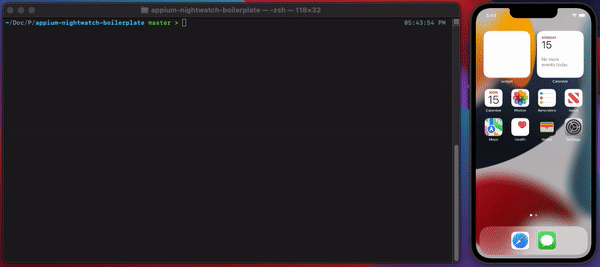

# Apppium-Nightwatch-Examples
Appium is an open source tools that help you drive your mobile apps(native, hybrid, and mobile web). At a high-level appium works on client-server architecture. 
Appium server is Node JS based web server that exposes REST APIs and bridges command to native frameworks.
## Overview
The aim of the repo is to demonstrate features of Nightwatch which will be useful for writing testcases for mobile devices.

## Demo



## Setup

1. To run tests locally on mobile devices we need to [download and setup Appium](https://appium.io/docs/en/about-appium/getting-started/?lang=en#installing-appium). 
2. Now that you have installed Appium, run the appium server using command:
```sh
$ appium
```
3. clone the repository:
```sh
$ git clone 
```
4. Install the dependencies
```sh
$ npm install
```
5. Run the test
```sh
$ npm test
```


## Configuration

We can add in a test setting in nightwatch config for appium server and then can extend for various desired target-devices/desired-capabilites to run on:

```js
'appium': {
      selenium: {
        host: 'localhost',
        port: 4723
      },
      disable_error_log: true,
      webdriver: {
        timeout_options: {
          timeout: 150000,
          retry_attempts: 3
        },
        keep_alive: true,
        start_process: false
      }
    },
    
    'appium.ios': {
      extends: 'appium',
      desiredCapabilities: {
        browserName: 'Safari',
        javascriptEnabled: true,
        platformName: 'iOS',
        platformVersion: '15.0',
        deviceName: 'iPhone 13'
        // "app": APP_PATH + "ios/PieDrive.app", // path for the ios app you want to test
      }
    },
```

## Gestures
 Gestures are commonly used while interacting with mobile devices. We can use non-standard APIs commands to generate gestures which would be specific to platform, commands like ` browser.execute('mobile: swipe', args);` to stimulate a swipe in iOS-specific platform. The other option is to use Actions API from Nightwatch that is based on W3C Webdriver Spec. Actions API is very general and is platform independent. It relies on the concept of input sources(key, pointer, wheel). You can refer [W3C spec](https://www.w3.org/TR/webdriver/#actions) for more details. The example test shows a sample swipe and zoom in using actions API.
